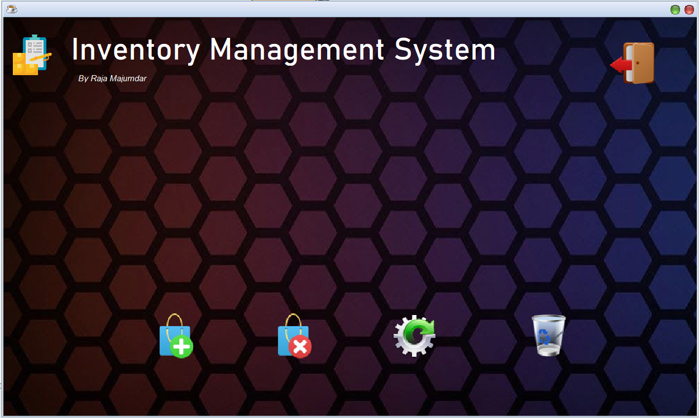

# INMAS
INMAS is an Inventory Management System in Java with GUI support that can be used to store, update or delete products and track inventory. It was my high school final year project that was featured in the Annual Tech Meetup.


## Screenshots

***

***

## Features 
* Real-time inventory tracking
* Easy-to-use GUI interface for users
* Add/Remove/Update Products
* Make Invoice
* Light weight
* Reliable database support with integrated MS Access database


## Prerequisites

INMAS requires JDK 8 or higher version (or BlueJ) and the following support .jar files
* commons-lang.jar
* commons-logging.jar
* JTattoo.jar
* hsqldb.jar
* ucanaccess.jar
* rs2xml.jar
* jackcess.jar

which can be found in the "Support files" folder.

## Installation (Windows)
```sh
git clone https://github.com/r3yc0n1c/INMAS.git
cd INMAS
```
* Download and install [BlueJ](https://www.bluej.org/versions.html)
* Copy the Support files in `C:\Program Files (x86)\BlueJ\lib\userlib`

OR

* Download the [inmas.jar](https://github.com/r3yc0n1c/INMAS/releases/) file


## Usage
* Open project in BlueJ
* Complie and Run


## TODO
* Proper Linux support
* Improve GUI 
* Add Automation Features